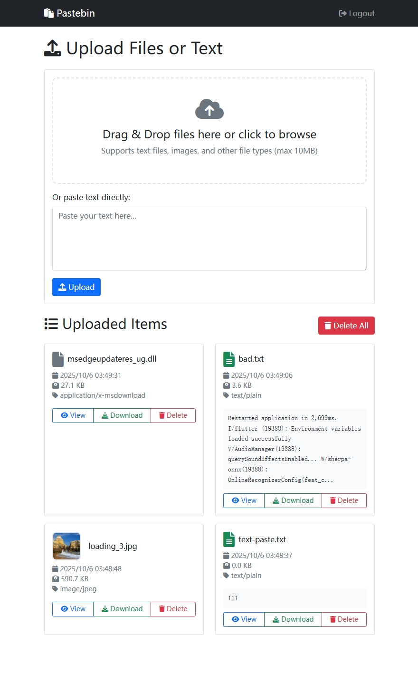

# Pastebin - Node.js File Upload & Text Sharing

A simple Node.js pastebin application that allows users to upload files, images, and share text with password protection.



## Features

1. **File Upload**: Upload text files, images, and other file types (max 10MB)
2. **Text Sharing**: Paste text directly without uploading files
3. **Item Management**: View uploaded items with pagination, preview text/images, download files
4. **Delete Operations**: Delete individual items or remove all items with one click
5. **Password Protection**: Simple password authentication with persistent sessions
6. **Admin Console**: Command-line tool for password management and statistics

## Installation

1. Install dependencies:
```bash
npm install
```

2. Start the server:
```bash
npm start
```

3. Open your browser and go to `http://localhost:3000`

## Running on Ubuntu Startup

To make the pastebin application run automatically when Ubuntu starts:

### Method 1: Using the Setup Script (Recommended)

1. **Make the script executable:**
   ```bash
   chmod +x setup-startup.sh
   ```

2. **Run the setup script as root:**
   ```bash
   sudo ./setup-startup.sh
   ```

This will:
- Install Node.js if needed
- Copy files to `/opt/pastebin`
- Install dependencies
- Create a systemd service
- Enable auto-start on boot

### Method 2: Manual Setup

1. **Install Node.js:**
   ```bash
   curl -fsSL https://deb.nodesource.com/setup_18.x | sudo -E bash -
   sudo apt-get install -y nodejs
   ```

2. **Create application directory:**
   ```bash
   sudo mkdir -p /opt/pastebin
   sudo cp -r . /opt/pastebin/
   cd /opt/pastebin
   sudo npm install --production
   ```

3. **Create systemd service:**
   ```bash
   sudo cp pastebin.service /etc/systemd/system/
   sudo systemctl daemon-reload
   sudo systemctl enable pastebin.service
   sudo systemctl start pastebin.service
   ```

### Service Management Commands

```bash
# Start/Stop/Restart service
sudo systemctl start pastebin
sudo systemctl stop pastebin
sudo systemctl restart pastebin

# Check status
sudo systemctl status pastebin

# View logs
sudo journalctl -u pastebin -f

# Disable auto-start
sudo systemctl disable pastebin
```

## Usage

### First Time Setup
- When you first access the application, you'll be prompted to set a password
- This password will be saved and used for all future logins
- The session will persist for 30 days to avoid repeated logins

### Uploading Content
- **Files**: Drag and drop files onto the upload area or click to browse
- **Text**: Paste text directly into the text area
- Supported file types: All file types up to 10MB

### Managing Items
- View uploaded items in a paginated list
- Click "View" to see text content or image previews
- Click "Download" to download files
- Click "Delete" to remove individual items
- Use "Delete All" to remove all items at once

### Admin Console
Run the admin console for server management:
```bash
npm run admin
```

Available admin commands:
1. Set password - Change the application password
2. Show statistics - View upload statistics and file type counts
3. Clear all items - Remove all uploaded items
4. Exit

## API Endpoints

- `GET /` - Main interface (requires authentication)
- `GET /login` - Login page
- `POST /login` - Authenticate user
- `POST /upload` - Upload files or text
- `GET /view/:id` - View specific item
- `GET /download/:id` - Download specific item
- `DELETE /delete/:id` - Delete specific item
- `DELETE /delete-all` - Delete all items
- `POST /logout` - Logout user
- `POST /admin/set-password` - Set password via API

## File Structure

```
pastebin/
├── server.js          # Main server file
├── admin.js           # Admin console script
├── package.json       # Dependencies and scripts
├── views/             # EJS templates
│   ├── layout.ejs     # Main layout template
│   ├── index.ejs      # Home page template
│   ├── login.ejs      # Login page template
│   └── view.ejs       # Item view template
├── uploads/           # Uploaded files directory (created automatically)
└── pastebin.db        # SQLite database (created automatically)
```

## Security Notes

- Passwords are hashed using bcrypt
- Sessions are stored server-side
- File uploads are limited to 10MB
- All uploaded files are stored in the `uploads/` directory


## nginx proxy

```

location /paste/ {
    proxy_pass http://127.0.0.1:3000/;
    proxy_set_header Host $host;
    proxy_set_header X-Real-IP $remote_addr;
    proxy_set_header X-Forwarded-For $proxy_add_x_forwarded_for;
    proxy_set_header X-Forwarded-Proto $scheme;
    
    # File upload support
    client_max_body_size 10M;
    proxy_read_timeout 300s;
    proxy_connect_timeout 75s;
}

```